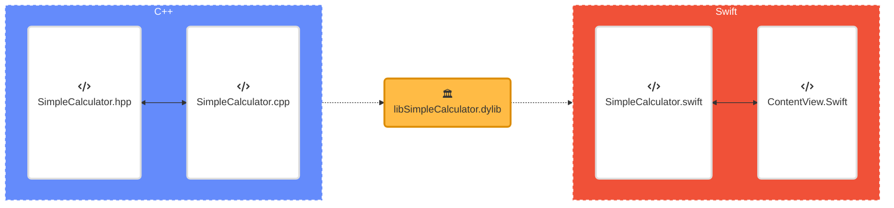
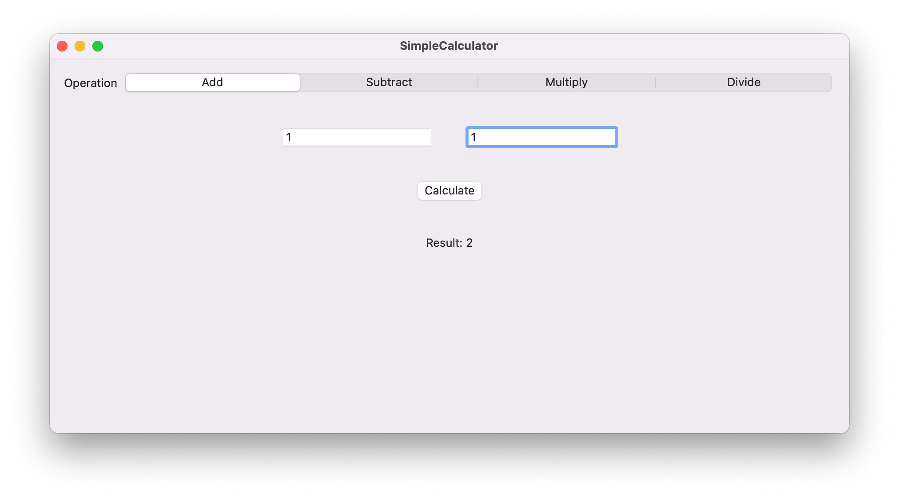
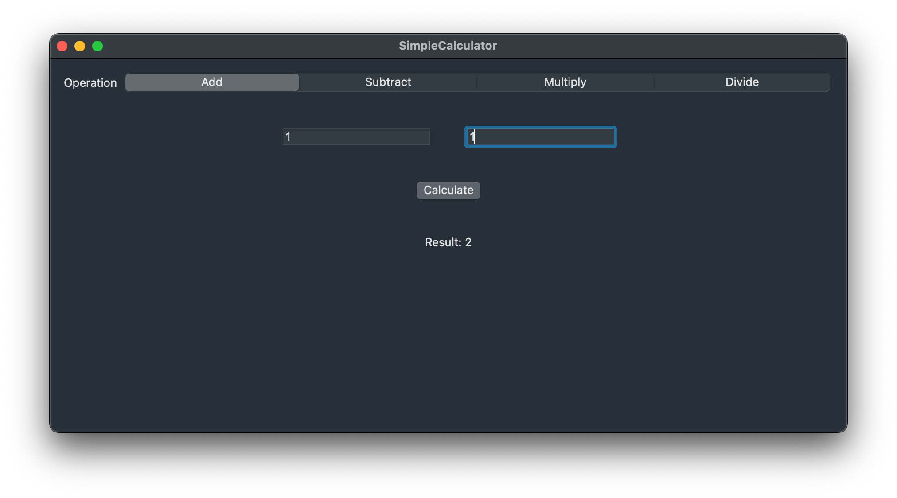

# Using a C++ `dylib` in SwiftUI



## Library Creation and Compilation

### Simple Calculator Example in C++

To begin, it is recommended to export all methods and instance constructors/destructors as C-Style exposed functions (in the style of a traditional API).

```cpp
// SimpleCalculator.hpp
#pragma once

#if defined(_WIN64)
    #define EXPORT __declspec(dllexport)
#elif defined(__APPLE__) && defined(__MACH__)
    #define EXPORT
#endif

class EXPORT SimpleCalculator {
public:
    SimpleCalculator();
    ~SimpleCalculator();

    int add(int a, int b);
    int subtract(int a, int b);
    int multiply(int a, int b);
    int divide(int a, int b);
};

#ifdef __cplusplus
extern "C" {
#endif

EXPORT SimpleCalculator* createSimpleCalculator();
EXPORT void destroySimpleCalculator(SimpleCalculator* calculator);
EXPORT int add(SimpleCalculator* calculator, int a, int b);
EXPORT int subtract(SimpleCalculator* calculator, int a, int b);
EXPORT int multiply(SimpleCalculator* calculator, int a, int b);
EXPORT int divide(SimpleCalculator* calculator, int a, int b);

#ifdef __cplusplus
}
#endif
```

```cpp
// SimpleCalculator.cpp
#include "SimpleCalculator.hpp"

SimpleCalculator::SimpleCalculator() {}

SimpleCalculator::~SimpleCalculator() {}

int SimpleCalculator::add(int a, int b) {
    return a + b;
}

int SimpleCalculator::subtract(int a, int b) {
    return a - b;
}

int SimpleCalculator::multiply(int a, int b) {
    return a * b;
}

int SimpleCalculator::divide(int a, int b) {
    if (b != 0) {
        return a / b;
    }
    else {
        // Error: Division by zero
        return 0;
    }
}

#ifdef __cplusplus
extern "C" {

SimpleCalculator* createSimpleCalculator() {
    return new SimpleCalculator();
}

void destroySimpleCalculator(SimpleCalculator* calculator) {
    delete calculator;
}

int add(SimpleCalculator* calculator, int a, int b) {
    return calculator->add(a, b);
}

int subtract(SimpleCalculator* calculator, int a, int b) {
    return calculator->subtract(a, b);
}

int multiply(SimpleCalculator* calculator, int a, int b) {
    return calculator->multiply(a, b);
}

int divide(SimpleCalculator* calculator, int a, int b) {
    return calculator->divide(a, b);
}

}
#endif
```

As seen in the example, pointers are used here not only for **C Interface Compatibility** but also for **Dynamic Memory Allocation**, **Separate Compilation Units** and finally **Dynamic Library Exporting(and Importing)**.

### Compiling with CMake

C++ projects often make use of a build system to abstract away the compilation complexity of a final application especially when the project depends on many third-party libraries (and considerably more when building them from source).

In this case, CMake was chosen as it integrates nicely with any IDE (it can even be used without an IDE) and provides all the necessary features to build the project as a dynamic library or `dylib`.

Below is the corresponding `CMakeLists.txt` file.

```cmake
cmake_minimum_required(VERSION 3.20.0)
project(SimpleCalculator VERSION 0.0.1 LANGUAGES CXX)

# Setting C++ Version to 2020
set(CMAKE_CXX_STANDARD 20)

# Set the path to your C++ source files
set(SOURCES
    ${CMAKE_CURRENT_SOURCE_DIR}/src/SimpleCalculator.cpp
)

# Set the path to your header files
set(HEADERS
    ${CMAKE_CURRENT_SOURCE_DIR}/include/SimpleCalculator.hpp
)

# Create the dynamic library
add_library(${PROJECT_NAME} SHARED ${SOURCES} ${HEADERS})

target_include_directories(${PROJECT_NAME}
    PUBLIC
        $<INSTALL_INTERFACE:include>
        $<BUILD_INTERFACE:${CMAKE_CURRENT_SOURCE_DIR}/include>
)

# Set the install name for the dynamic library
set_target_properties(${PROJECT_NAME} PROPERTIES
    BUILD_WITH_INSTALL_RPATH TRUE
    INSTALL_NAME_DIR "@rpath"
)

# Optionally, set additional compiler flags if needed
# target_compile_options(Calculator PRIVATE ...)

# Optionally, set additional include directories if needed
# target_include_directories(Calculator PRIVATE ...)

# Optionally, link against additional libraries if needed
# target_link_libraries(Calculator PRIVATE ...)

# Set the installation path for the dynamic library
install(TARGETS ${PROJECT_NAME}
    LIBRARY DESTINATION lib
)
```

After building, the resulting file is a `dylib` file under the name `libSimpleCalculator.dylib`.

## Importing into Xcode

After creating a project, targeting macOS and using Swift, copy the library file manually to the project folder and then from the Finder window with the project folder open, drag the library into Xcode as though it was being dropped into the project folder once again.


When asked ensure `Copy items if needed` is selected, `Create groups` and finally verify that the correct app is being targeted.


Under `Frameworks, Libraries and Embedded Content `, change from `Do Not Embed` to `Embed & Sign`.

## Wrapping it up in Swift

### Creating a Wrapper Class

To do this, simply right-clicking in the project's folder's folder and selecting `New File...`, making sure `macOS` is selected and select under `Source`, `Swift File`, give the file a suitable name, make sure it's targetting the right project and hit `Create`.

```swift
import Foundation

class SimpleCalculatorWrapper {
    private let simpleCalculator: OpaquePointer
    
    init() {
        simpleCalculator = createSimpleCalculator()
    }
    
    deinit {
        destroySimpleCalculator(simpleCalculator)
    }
    
    func add(a: Int32, b: Int32) -> Int32 {
        return addNumbers(simpleCalculator, a, b)
    }
    
    func subtract(a: Int32, b: Int32) -> Int32 {
        return subtractNumbers(simpleCalculator, a, b)
    }
    
    func multiply(a: Int32, b: Int32) -> Int32 {
        return multiplyNumbers(simpleCalculator, a, b)
    }
    
    func divide(a: Int32, b: Int32) -> Int32 {
        return divideNumbers(simpleCalculator, a, b)
    }
}

// Import the C functions from the dynamic library
private func createSimpleCalculator() -> OpaquePointer {
    let library = dlopen("libSimpleCalculator.dylib", RTLD_NOW) // Replace with the actual library name
    let symbol = dlsym(library, "createSimpleCalculator")
    let function = unsafeBitCast(symbol, to: (@convention(c) () -> OpaquePointer).self)
    return function()
}

private func addNumbers(_ simpleCalculator: OpaquePointer, _ a: Int32, _ b: Int32) -> Int32 {
    let library = dlopen("libSimpleCalculator.dylib", RTLD_NOW) // Replace with the actual library name
    let symbol = dlsym(library, "add")
    let function = unsafeBitCast(symbol, to: (@convention(c) (OpaquePointer, Int32, Int32) -> Int32).self)
    return function(simpleCalculator, a, b)
}

private func subtractNumbers(_ simpleCalculator: OpaquePointer, _ a: Int32, _ b: Int32) -> Int32 {
    let library = dlopen("libSimpleCalculator.dylib", RTLD_NOW) // Replace with the actual library name
    let symbol = dlsym(library, "subtract")
    let function = unsafeBitCast(symbol, to: (@convention(c) (OpaquePointer, Int32, Int32) -> Int32).self)
    return function(simpleCalculator, a, b)
}

private func multiplyNumbers(_ simpleCalculator: OpaquePointer, _ a: Int32, _ b: Int32) -> Int32 {
    let library = dlopen("libSimpleCalculator.dylib", RTLD_NOW) // Replace with the actual library name
    let symbol = dlsym(library, "multiply")
    let function = unsafeBitCast(symbol, to: (@convention(c) (OpaquePointer, Int32, Int32) -> Int32).self)
    return function(simpleCalculator, a, b)
}

private func divideNumbers(_ simpleCalculator: OpaquePointer, _ a: Int32, _ b: Int32) -> Int32 {
    let library = dlopen("libSimpleCalculator.dylib", RTLD_NOW) // Replace with the actual library name
    let symbol = dlsym(library, "divide")
    let function = unsafeBitCast(symbol, to: (@convention(c) (OpaquePointer, Int32, Int32) -> Int32).self)
    return function(simpleCalculator, a, b)
}

// Clean up the calculator instance
private func destroySimpleCalculator(_ simpleCalculator: OpaquePointer) {
    let library = dlopen("libSimpleCalculator.dylib", RTLD_NOW) // Replace with the actual library name
    let symbol = dlsym(library, "destroySimpleCalculator")
    let function = unsafeBitCast(symbol, to: (@convention(c) (OpaquePointer) -> Void).self)
    function(simpleCalculator)
}
```

Here each class method calls the loaded functions from the `dylib` providing the developer experience to feel like the library belongs in Swift. With this approach, documentation can be added to the wrapper class's methods providing an even richer feel to the API.

### Using the Wrapper in SwiftUI

Inside of a `View`, a `SimpleCalculatorWrapper()` class object can be created and in this example will simply be named `calculator`. I have seen folks also use suffix "Imp" short for implementation, but in this case "Wrapper" describes the behaviour better. Below is the usage of the SwiftUI class.

```swift
import SwiftUI

struct ContentView: View {
    @State private var number1 = ""
    @State private var number2 = ""
    @State private var operation = 0
    @State private var result = ""
    
    let operations = ["Add", "Subtract", "Multiply", "Divide"]
    
    private let calculator = SimpleCalculatorWrapper()
    
    var body: some View {
        VStack {
            Picker("Operation", selection: $operation) {
                ForEach(operations.indices, id: \.self) { index in
                    Text(self.operations[index])
                }
            }
            .pickerStyle(SegmentedPickerStyle())
            .padding()
            
            HStack {
                TextField("Number 1", text: $number1)
                    .padding()
                    .frame(maxWidth: 200)
                
                TextField("Number 2", text: $number2)
                    .padding()
                    .frame(maxWidth: 200)
            }
            
            Button("Calculate") {
                calculateResult()
            }
            .padding()
            
            Text("Result: \(result)")
                .padding()
            
            Spacer()
        }
    }
    
    private func calculateResult() {
        guard let num1 = Int32(number1), let num2 = Int32(number2) else {
            result = "Invalid numbers"
            return
        }
        
        switch operation {
        case 0:
            result = "\(calculator.add(a: num1, b: num2))"
        case 1:
            result = "\(calculator.subtract(a: num1, b: num2))"
        case 2:
            result = "\(calculator.multiply(a: num1, b: num2))"
        case 3:
            result = "\(calculator.divide(a: num1, b: num2))"
        default:
            result = "Invalid operation"
        }
    }
}

struct ContentView_Previews: PreviewProvider {
    static var previews: some View {
        ContentView()
    }
}
```

## Conclusions

After spending 2 whole days demystifying importing dynamic libraries built with CMake into Xcode and then using them in Swift and SwiftUI, I can say that I am satisfied. Below are screenshots of the final Application built in Light and Dark mode. I hope this helps those who needed it!




